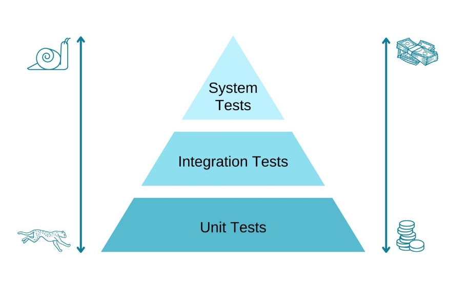

# Skript Session 7

## Veränderung von Parametern
Normalerweise enthält eine Variable, die vor einem Methodenaufruf deklariert wird und dann einer Methode übergeben wird, nach dem Methodenaufruf immer denselben Wert wie zuvor,
auch wenn innerhalb der Methode Veränderungen darauf vorgenommen werden.
Es gibt aber einen Sonderfall, in dem das nicht so ist. Modifiziert man innerhalb einer Methode einen Parameter, der auf ein Objekt (dazu gehören auch Arrays) zeigt,
ändert sich auch der Wert außerhalb der Methode.

Das liegt an folgendem Prinzip: Wir übergeben zwar das Objekt als Parameter, dieses Objekt ist allerdings nur eine Referenz auf den tatsächlichen Wert (reference type).
Sowohl das Original-Objekt außerhalb der Methode als auch das Parameter-Objekt innerhalb der Methode referenzieren auf denselben Wert.
Ändern wir nun etwas am Objekt, ändern wir tatsächlich den Wert, der hinter der Referenz liegt. Dadurch ändern sich die Werte für alle Objekte, die auf diesen Wert referenzieren.

Hierzu ein Beispiel:

```java
private static void modify(String[] strings) {
        strings[0] = "foo";
        strings[1] = "bar";
        }

public static void main(String[] args) {
        String[] strings = new String[2];

        strings[0] = "Hallo";
        strings[1] = "Welt";

        System.out.println(strings[0]); // Hallo
        System.out.println(strings[1]); // Welt

        modify(strings);

        System.out.println(strings[0]); // foo
        System.out.println(strings[1]); // bar
        }
```

## Arbeiten mit dem Datentyp `char`
* In einem `char` kann man im Gegensatz zu einem String nur ein einzelnes Zeichen ablegen
* Zu jedem `char` Zeichen existiert eine dezimale Repräsentation (siehe [ASCII-Tabelle](https://de.wikipedia.org/wiki/American_Standard_Code_for_Information_Interchange#ASCII-Tabelle))
* Aus diesem Grund kann man in Java auch mit `char` Variablen rechnen:
   ```java
   char c = 'A';
   c++;
   system.out.print(c); // Ausgabe: B
   ```
  oder:
   ```java
   char c = 'J' - '"';
   system.out.print(c); // Ausgabe: (
   ```
  oder in Schleifen verwenden:
   ```java
   for (char c = 'a'; c <= 'z'; c++) {
      System.out.println(c);
   }
   ```
* Die dezimale Repräsentation eines `char` erhält man, wenn man die Variable in einen `int` castet. Hierfür schreibt
  man einfach `(int)` vor den `char`: `(int) 'A'` ergibt beispielsweise `65`, also die Position des großen A in der
  ASCII-Tabelle. In die andere Ruichtung, also von `int` zu `char` funktioniert übrigens genauso: `(char) 65` ergibt `A`

## Tests
Tests lassen sich im Wesentlichen in drei Kategorien einteilen:
- Unittests
- Integrationtests
- Systemtest (z.B. E2E-Tests)

### Unittests
Bei den Unittests handelt es sich um den granularsten Typ der Tests. Hier wird immer eine Unit bzw. Einheit abgetestet.
Meistens ist dies eine Methode. Alle Methoden, die innerhalb dieser Methode aufgerufen werden und komplexere ausgelagerte
Logik enthalten, werden gefaked. Das nennt sich dann "Mock".
Das heißt, die gemockte Methode wird beim Aufruf nicht wirklich ausgeführt, sondern gibt lediglich den von uns definierten Wert zurück.
Somit stellen wir sicher, dass wir nur die zu testende Methode (Unit) testen. Ein häufig verwendetet Framework hierfür ist `Mockito`.


Beispiel:
````java
// eine Methode in einer Klasse
public int sumPositivNumbers(int a, int b){
    if (isPositivNumber(a) && isPositivNumber(b)){
        return a + b;
        } else {
         // irgendein Errorhandling
        }
}
    
// ein Testfall in einer Unittest-Testklasse
@Test
public void shouldCalculatedTheSumOfPositivNumbers(){
    //Given
    when(isPositivNumber(anyInteger())).thenReturn(true);
    int a = 5;
    int b = 5;
    int expectedResult = 10;
    
    //When
    int actualResult = sum(a, b);
    
    //Then
    assertEquals(expectedResult, actualResult);
}
````

### Integrationtests
Ein Integrationtest testet die Zusammenarbeit (Integration) von Units. Dies bezieht sich aber nicht nur auf
Komponenten im Code, sondern auch auf Komponenten außerhalb des Codes, wie eine Datenbank oder eine Queue aus der AWS.
Bei Integrationstests wird meistens nichts gemockt, da die tatsächliche Methode aller beteiligten Komponenten getestet werden soll.

Beispiel:
````java
// ein Testfall in einer Integrationtest-Testklasse
@Test
public void shouldCalculateTheSumOfPositiveNumbers(){
    //Given
    int a = 5;
    int b = 5;
    int expectedResult = 10;

    //When
    int actualResult = sum(a, b);

    //Then
    assertEquals(expectedResult, actualResult);
}
````

### Systemtests
Es gibt mehrere Systemtest-Typen. Beispiele sind End-to-End-Tests (E2E), Performance-Tests, Smoke-Tests und Load-Tests. Im Folgenden
werden wir nur auf die E2E-Tests eingehen, den Rest könnt ihr bei Bedarf recherchieren.

Bei E2E-Tests wird ein Input in das zu testende System gegeben und dann geprüft, ob der Output korrekt ist.
Der Input kann eine Datei oder bloß eine Interaktion auf einer Website sein. Zwischen Input und Output liegen oft viele Softwarekomponenten, die der Test alle nicht direkt betrachtet. Es wird nur auf den Output am Ende geprüft.
Bei so einer Art Test spricht man auch von einem Blackbox-Test, weil während des Tests für den Tester
nicht bekannt ist, welche Teile des Systems bzw. Programms gerade im Detail durchlaufen werden.

```java
package Ueb04; //Das package sollte das selbe sein, wie die zu testende klasse. Ansonsten müsst ihr importieren

import org.junit.Test;

import static org.junit.jupiter.api.Assertions.assertEquals;

public class SentenceInvestigatorTest {

  @Test
  public void shouldCountSpaces() {
    // Given
    String testSentence1 = "I Like Turtles!";
    String testSentence2 = "ILikeTurtles!";
    int expectedWhiteSpaceCount1 = 2;
    int expectedWhiteSpaceCount2 = 0;

    // When
    int result1 = SentenceInvestigatorSolution.countWhiteSpaces(testSentence1);
    int result2 = SentenceInvestigatorSolution.countWhiteSpaces(testSentence2);

    // Then
    assertEquals(expectedWhiteSpaceCount1, result1);
    assertEquals(expectedWhiteSpaceCount2, result2);
  }
```

#### Unhappy Path
Bei Integrations- und Unittests ist es wichtig, neben positiven Testfällen auch negative Testfälle abzutesten.
Das heißt, wir testen nicht nur, dass das erwartete Verhalten beim erwarteten Aufruf eintritt (Happy Path), sondern auch,
dass in nicht erwarteten Fällen und Edge-Cases das korrekte Verhalten auftritt (Unhappy Path).

### Die Testpyramide
Ihr habt vielleicht schon erkannt, dass E2E Tests deutlich komplexer sind als Unit-Tests und auch in der Ausführung länger dauern dürften.
Deswegen orientiert man sich in der Auswahl der Testtypen an der sogenannten Testpyramide:


Unit-Tests sind günstig und schnell ausführbar, weshalb man versucht, den Großteil seines Codes damit abzudecken.
Vereinzelt sind integrationstests sinnvoll, Systemtests kommen nur wenige und für sehr spezifische Testcases zum Einsatz.

### Test Driven Development
Wie geht man am besten beim Programmieren mit Tests vor? Ein beliebtes Pattern ist Test Driven Development (TDD).
Es läuft nach dem Schema unten ab, kurz "Red, Green, Refactor"

- Red: Schreibe den kleinstmöglichen Testcase, der fehlschlägt
- Green: Modifiziere den Code im kleinstmöglichen Ausmaß, sodass der Test positiv wird
- Refactor: Ziehe den Code glatt.
- Wiederholen

Knallhart umgesetzt bedeutet das Zyklen von jeweils nur wenigen Zeilen Code, mit vielen schnellen Iterationen.
In der Realität versucht man oft einfach darauf zu achten, erst einen Test zu dem Verhalten zu schreiben, das man Umsetzen will.

Versucht beim Bearbeiten der Aufgaben zukünftig, Test Driven zu arbeiten. Ihr könnt dieses Vorgehen auch fürs Pairing arbeiten, indem z.B. einer den Test schreibt und die andere diesen Test bedienen muss.


## Kommandozeilenparameter in IntelliJ
Um Kommandozeilenparameter in IntelliJ zu setzen:
- klickt auf das Play-Zeichen links neben der Main.
- wählt die untere Option "Edit/ Run Configuration".
- im Pop-Up unter "Programm Arguments" die Parameter kommasepariert angeben.


Testet vor der Abgabe selbst mit verschiedenen Strings für alle Methoden, ob die Berechnung wie gewünscht funktioniert und dass Ihr keine globalen Variablen mehr im Code habt!